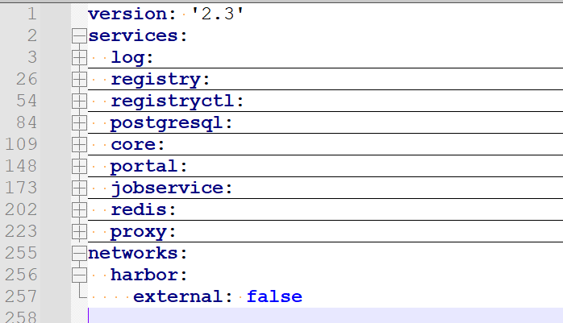
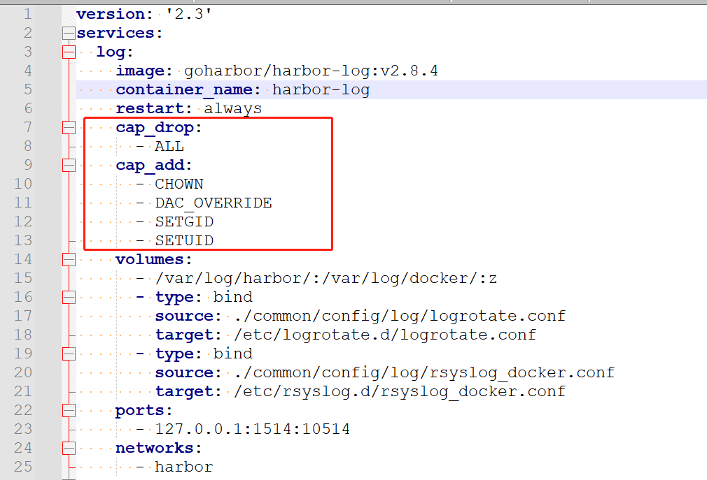
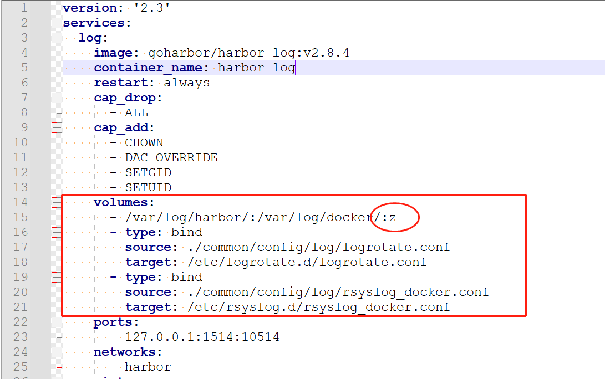
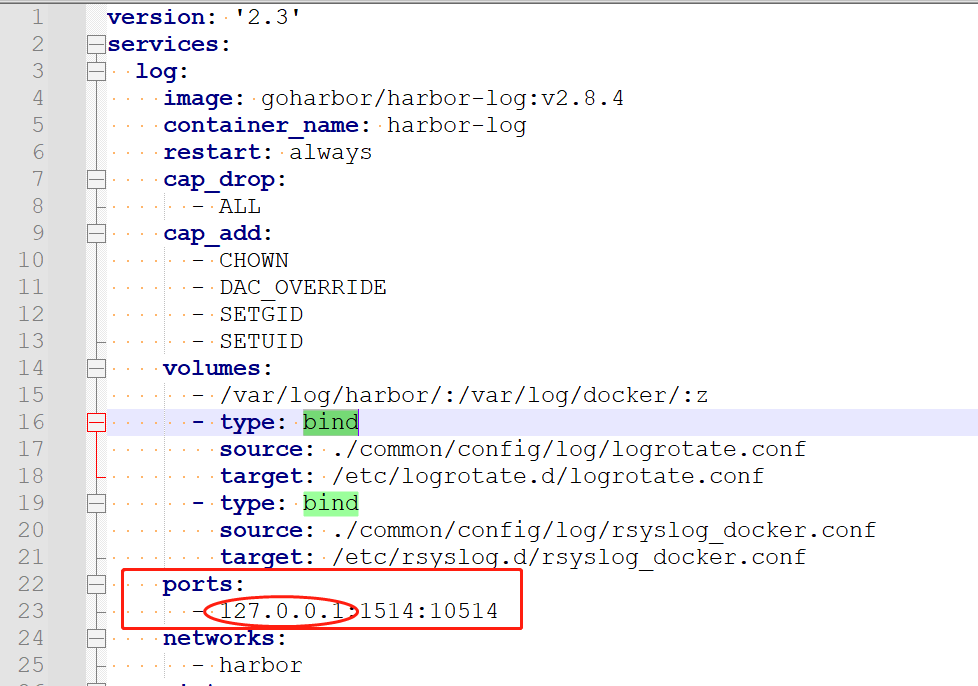
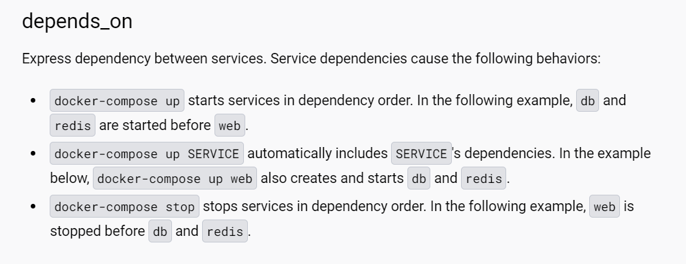
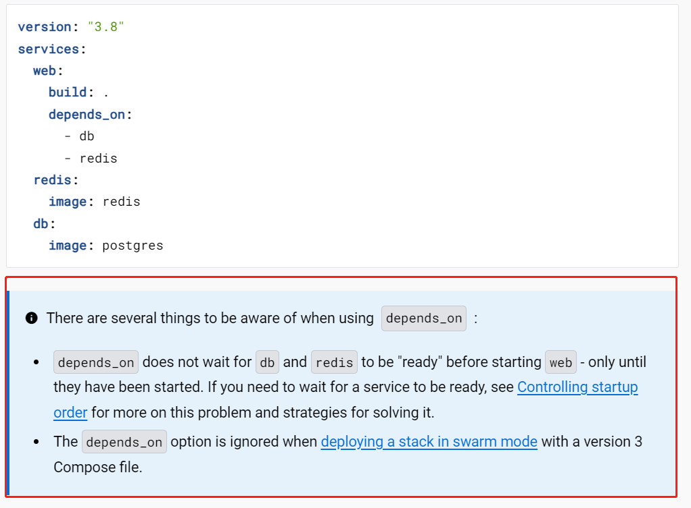
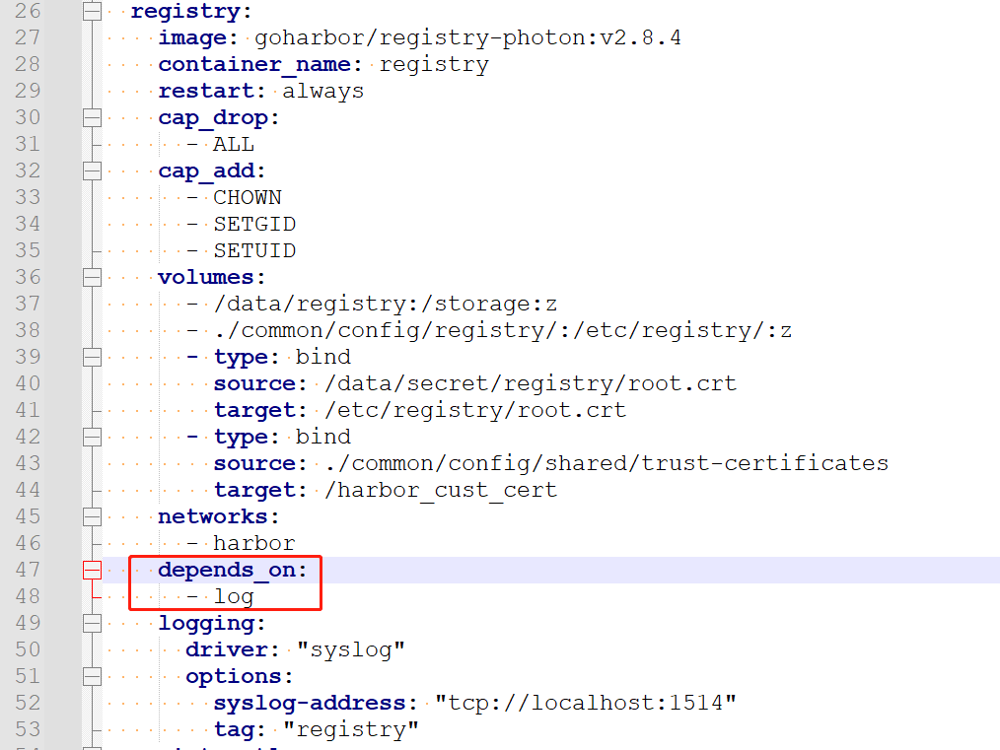
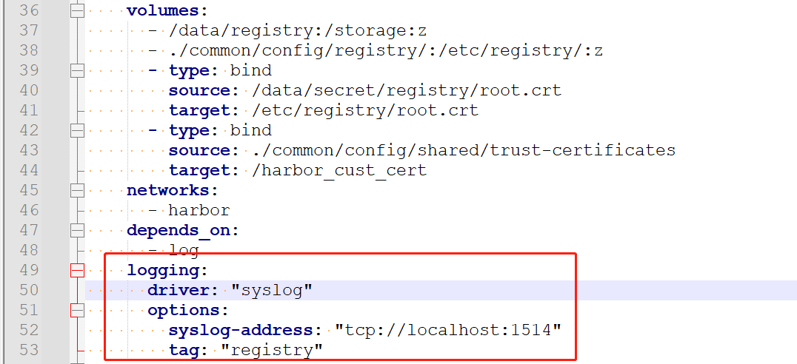
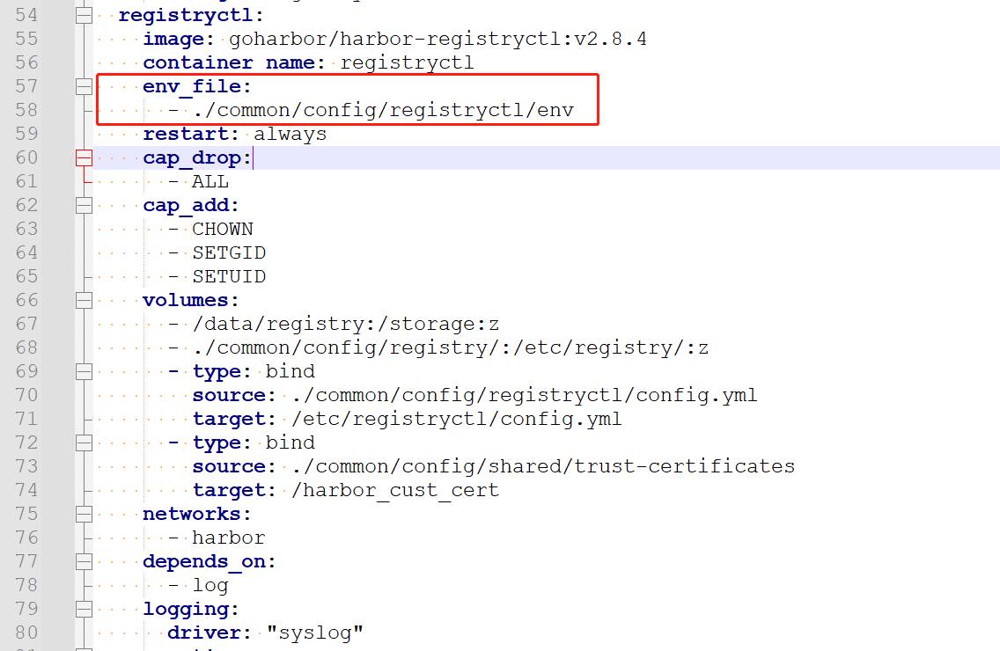
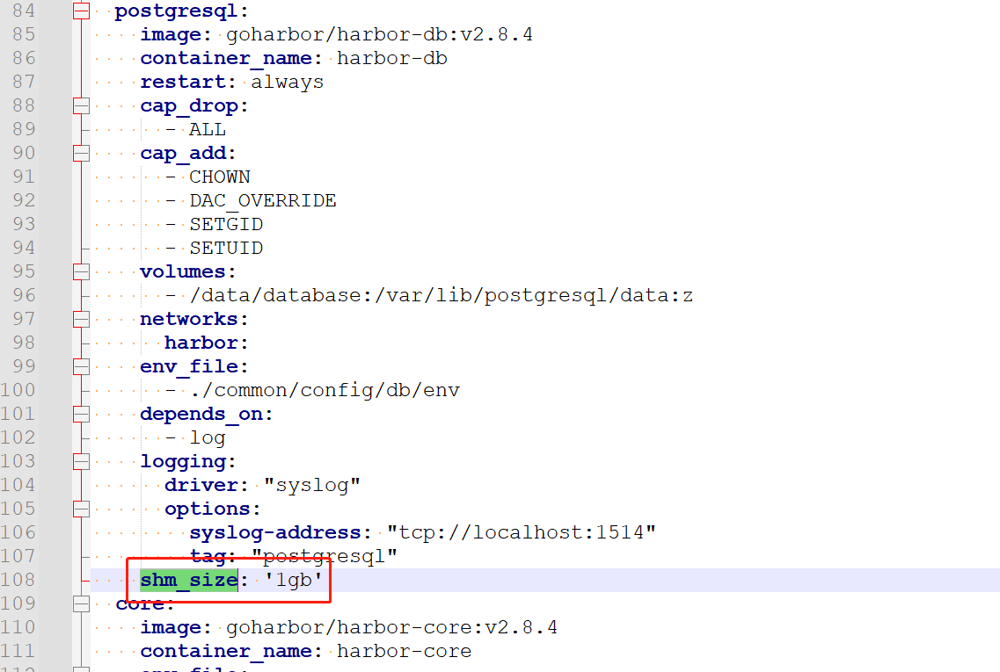

#### harbor之docker-compose.yaml源码鉴赏

* harbor服务整体框架
  

  框架很简单，yaml版本、服务和网络三大部分

* Linux capabilities--cap_drop|cap_add
  官方技术文档说明：https://docs.docker.com/compose/compose-file/compose-file-v3/
  在Linux主机上执行 man 7 capabilities 可以获取完整列表
  注意：先cap_drop all，然后cap_add 逐个添加，实现权限的更小颗粒控制
  

* volumes--z|Z  大小z的区别 一个多容器共享 一个容器独享

   

  官方技术文档：https://docs.docker.com/storage/bind-mounts/

  - The `z` option indicates that the bind mount content is shared among multiple containers.
  - The `Z` option indicates that the bind mount content is private and unshared.

* docker volume and bind mount -- 卷与bind挂载的区别 核心在于对空文件的处理

  * volume 与 bind mount 不同的是，如果volume是空的而container中的目录有内容，那么docker会将container目录中的内容拷贝到volume中，但是如果volume中已经有内容，则会将container中的目录覆盖----此种情况适合初始化容器从容器内往外释放文件，用于下一步其他容器使用

  * bind mount 不管container中的目录是否有值，都要覆盖容器映射的目录

* 端口暴露
  

  端口暴露容器内部加上了127.0.0.1回环地址，减少服务暴露面，加强安全性

* depends_on

  官方技术文档：[Compose file version 3 reference | Docker Docs](https://docs.docker.com/compose/compose-file/compose-file-v3/)

  
  

  

   

* logging--Logging configuration for the service.
  官方技术文档：https://docs.docker.com/compose/compose-file/compose-file-v3/
  docker容器默认日志存储位置：/var/lib/docker/containers/容器ID/容器ID-json.log

  将日志托管给系统的syslog
  

* env_file--将环境变量放在了文件里
  

* shm-size

  设置容器内/dev/shm目录的大小
  /dev/shm目录非常重要，此目录并不在硬盘上，而是在内存中，默认大小为内存的一半大小,存入其中的文件不会被清空，容器内划分此目录可以一定程度上指定容器的性能
  Linux查看共享内存命令：df -hT | grep shm

* 源码

  ```yaml
  version: '2.3'
  services:
    log:
      image: goharbor/harbor-log:v2.8.4
      container_name: harbor-log
      restart: always
      cap_drop:
        - ALL
      cap_add:
        - CHOWN
        - DAC_OVERRIDE
        - SETGID
        - SETUID
      volumes:
        - /var/log/harbor/:/var/log/docker/:z
        - type: bind
          source: ./common/config/log/logrotate.conf
          target: /etc/logrotate.d/logrotate.conf
        - type: bind
          source: ./common/config/log/rsyslog_docker.conf
          target: /etc/rsyslog.d/rsyslog_docker.conf
      ports:
        - 127.0.0.1:1514:10514
      networks:
        - harbor
    registry:
      image: goharbor/registry-photon:v2.8.4
      container_name: registry
      restart: always
      cap_drop:
        - ALL
      cap_add:
        - CHOWN
        - SETGID
        - SETUID
      volumes:
        - /data/registry:/storage:z
        - ./common/config/registry/:/etc/registry/:z
        - type: bind
          source: /data/secret/registry/root.crt
          target: /etc/registry/root.crt
        - type: bind
          source: ./common/config/shared/trust-certificates
          target: /harbor_cust_cert
      networks:
        - harbor
      depends_on:
        - log
      logging:
        driver: "syslog"
        options:
          syslog-address: "tcp://localhost:1514"
          tag: "registry"
    registryctl:
      image: goharbor/harbor-registryctl:v2.8.4
      container_name: registryctl
      env_file:
        - ./common/config/registryctl/env
      restart: always
      cap_drop:
        - ALL
      cap_add:
        - CHOWN
        - SETGID
        - SETUID
      volumes:
        - /data/registry:/storage:z
        - ./common/config/registry/:/etc/registry/:z
        - type: bind
          source: ./common/config/registryctl/config.yml
          target: /etc/registryctl/config.yml
        - type: bind
          source: ./common/config/shared/trust-certificates
          target: /harbor_cust_cert
      networks:
        - harbor
      depends_on:
        - log
      logging:
        driver: "syslog"
        options:
          syslog-address: "tcp://localhost:1514"
          tag: "registryctl"
    postgresql:
      image: goharbor/harbor-db:v2.8.4
      container_name: harbor-db
      restart: always
      cap_drop:
        - ALL
      cap_add:
        - CHOWN
        - DAC_OVERRIDE
        - SETGID
        - SETUID
      volumes:
        - /data/database:/var/lib/postgresql/data:z
      networks:
        harbor:
      env_file:
        - ./common/config/db/env
      depends_on:
        - log
      logging:
        driver: "syslog"
        options:
          syslog-address: "tcp://localhost:1514"
          tag: "postgresql"
      shm_size: '1gb'
    core:
      image: goharbor/harbor-core:v2.8.4
      container_name: harbor-core
      env_file:
        - ./common/config/core/env
      restart: always
      cap_drop:
        - ALL
      cap_add:
        - SETGID
        - SETUID
      volumes:
        - /data/ca_download/:/etc/core/ca/:z
        - /data/:/data/:z
        - ./common/config/core/certificates/:/etc/core/certificates/:z
        - type: bind
          source: ./common/config/core/app.conf
          target: /etc/core/app.conf
        - type: bind
          source: /data/secret/core/private_key.pem
          target: /etc/core/private_key.pem
        - type: bind
          source: /data/secret/keys/secretkey
          target: /etc/core/key
        - type: bind
          source: ./common/config/shared/trust-certificates
          target: /harbor_cust_cert
      networks:
        harbor:
      depends_on:
        - log
        - registry
        - redis
        - postgresql
      logging:
        driver: "syslog"
        options:
          syslog-address: "tcp://localhost:1514"
          tag: "core"
    portal:
      image: goharbor/harbor-portal:v2.8.4
      container_name: harbor-portal
      restart: always
      cap_drop:
        - ALL
      cap_add:
        - CHOWN
        - SETGID
        - SETUID
        - NET_BIND_SERVICE
      volumes:
        - type: bind
          source: ./common/config/portal/nginx.conf
          target: /etc/nginx/nginx.conf
      networks:
        - harbor
      depends_on:
        - log
      logging:
        driver: "syslog"
        options:
          syslog-address: "tcp://localhost:1514"
          tag: "portal"
  
    jobservice:
      image: goharbor/harbor-jobservice:v2.8.4
      container_name: harbor-jobservice
      env_file:
        - ./common/config/jobservice/env
      restart: always
      cap_drop:
        - ALL
      cap_add:
        - CHOWN
        - SETGID
        - SETUID
      volumes:
        - /data/job_logs:/var/log/jobs:z
        - type: bind
          source: ./common/config/jobservice/config.yml
          target: /etc/jobservice/config.yml
        - type: bind
          source: ./common/config/shared/trust-certificates
          target: /harbor_cust_cert
      networks:
        - harbor
      depends_on:
        - core
      logging:
        driver: "syslog"
        options:
          syslog-address: "tcp://localhost:1514"
          tag: "jobservice"
    redis:
      image: goharbor/redis-photon:v2.8.4
      container_name: redis
      restart: always
      cap_drop:
        - ALL
      cap_add:
        - CHOWN
        - SETGID
        - SETUID
      volumes:
        - /data/redis:/var/lib/redis
      networks:
        harbor:
      depends_on:
        - log
      logging:
        driver: "syslog"
        options:
          syslog-address: "tcp://localhost:1514"
          tag: "redis"
    proxy:
      image: goharbor/nginx-photon:v2.8.4
      container_name: nginx
      restart: always
      cap_drop:
        - ALL
      cap_add:
        - CHOWN
        - SETGID
        - SETUID
        - NET_BIND_SERVICE
      volumes:
        - ./common/config/nginx:/etc/nginx:z
        - /data/secret/cert:/etc/cert:z
        - type: bind
          source: ./common/config/shared/trust-certificates
          target: /harbor_cust_cert
      networks:
        - harbor
      ports:
        - 80:8080
        - 443:8443
      depends_on:
        - registry
        - core
        - portal
        - log
      logging:
        driver: "syslog"
        options:
          syslog-address: "tcp://localhost:1514"
          tag: "proxy"
  networks:
    harbor:
      external: false
  
  ```

